**Introduction to 123D Design**

123D Design is a free 3D modeling program. 3D modeling is a key step in the prototyping work cycle. It allows you to envision your project as though it were three dimensional and get a basic idea of how a physical model would appear. We asked you to bring a photo with you today so that you can turn a 2D representation into a 3D model. I've included a simple example below, along with a series of instructions describing the programs many available tools. 

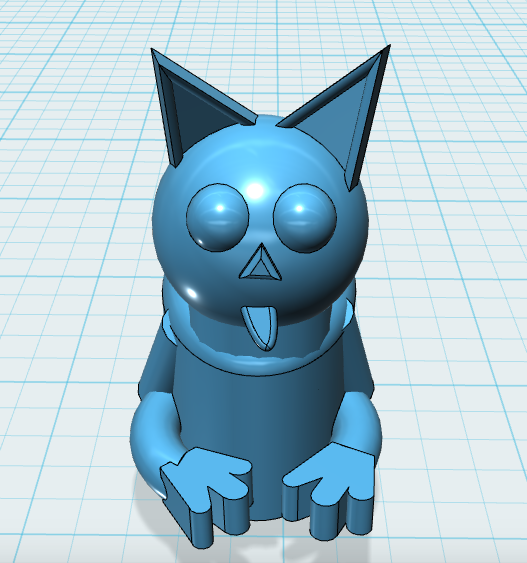

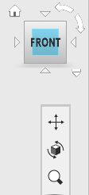

**Moving Your Perspective**

Orbit - Right click as you move your mouse.

Zoom - Scroll your mouse or trackpad (Up = zoom in, Down = zoom out).

Left click - Pan your view.

Or select the orbit, panning, or zoom option from the right hand menu. You can also adjust the direction of your view or hit the home button to return to your original view of the grid.

**Selecting a simple object**

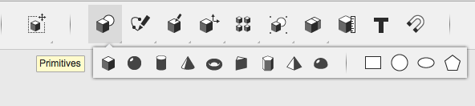

**Moving an Object**

Circle in the center of the object = freely move object along all 3 axes, depending on what perspective you are looking at the obiect from.

White isolated arrows = slide object along one axis.

Semi-transparent squares = move object across two axes at once (ex. X and Z, but not Y).

Radial dials (Outside circle with arrows on either side) = rotate object.

A white box will pop up alongside the object whenever you select one of these movement options. This allows you to control how much you want to move the object by mm or degree. 
  

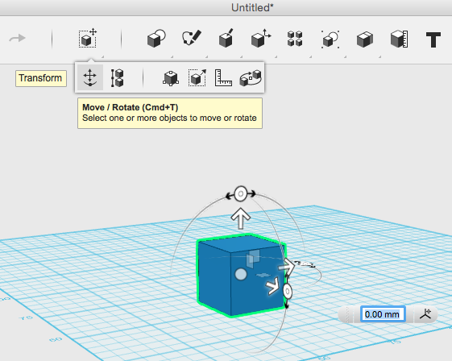

**Playing with Scale**

Select scale from the dropdown menu.

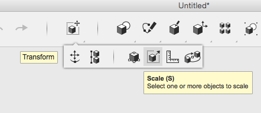

Click on the white arrow (which will then turn yellow) and drag to make your shape larger or smaller. The grey box below allows you to adjust by factor.

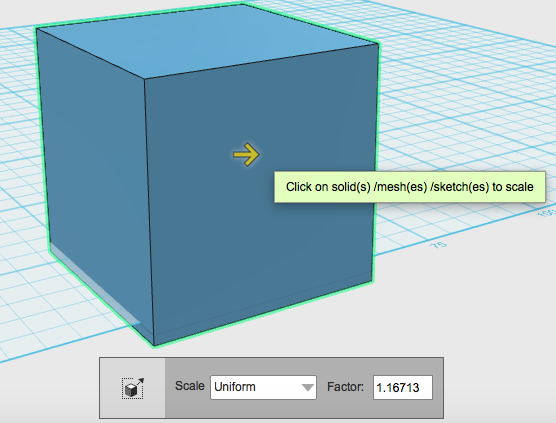

To scale an object non-uniformly select the scale dropdown menu from the grey box, then select non uniform. You will then be able to scale your shape along the X, Y and Z vertices by dragging the arrows or by adjusting the factor number. Non-uniform scale can be quite useful for curved objects (ex. sphere).

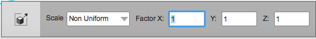

**Smart Scale**

Select smart scale from drop-down menu.

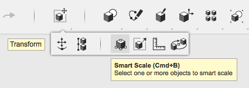

Select any manipulator square (found along corners, faces, and edges) and drag it in the direction you want to scale your object.

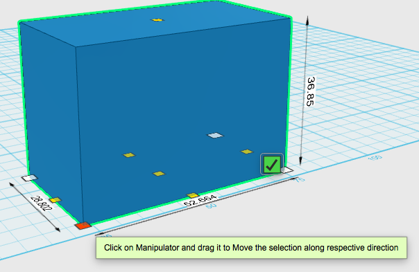

**Align Objects**

Select the align tool from the main menu. Then use your selection box to highlight the object you want to align. 

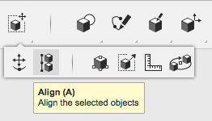

Once the objects have been selected a large grid will appear with dots along the X,Y, and Z axes. You can select these dots to drag all objects to that plane. An transparent orange shape will show where objects will move when you hover over of the dots and a red ghost grid will represent the plane associated with that dot. 

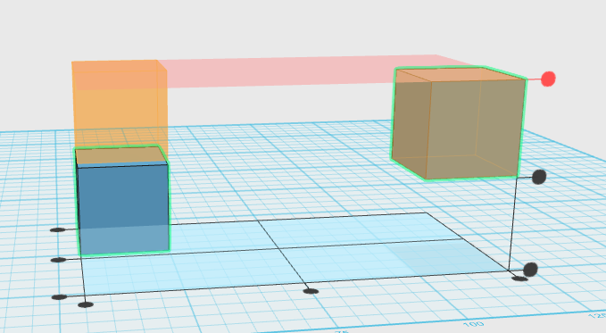

**Grouping Objects**

The grouping tool allows you to select objects you want to link so that they move together. (The other options under the grouping dropdown menu allow you to ungroup objects).

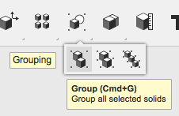

Once objects are grouped they will automatically move, scale, etc together. If you group too many objects together at the same time you may experience some lag with the program, so if you want the objects to stay together permanently, you may want to select the merge tool instead.

**Snap objects together**

Select the snap tool from the dropdown menu.

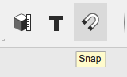

Then select two faces from objects on your grid and they will snap together as though they are magnets. 

The first face you select will move onto the second face you select. The snap tool will also autogroup those objects, so if you want to continue moving them separately, you may need to ungroup them. 

**Merge Objects**

Select merge from under the combine menu. 

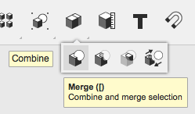

Then click on the two objects you would like to merge, and hit enter.    

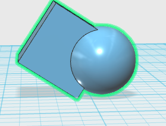

**Subtract sections from object**

Select subtract from the combine dropdown menu, then select your two object. 

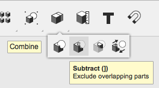

The first object you select will be the one that remains, while the second object will be subtracted out of that object. In the example below, my first object was a cube. My second object was a sphere, which was subtracted out of the cube.

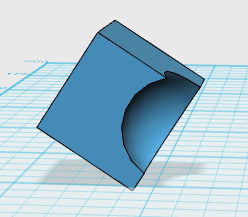

**Intersect objects**

Select the intersect tool from the combine menu. 

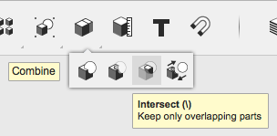

Like merge and subtract, you select two objects. When you hit enter, it will only keep the sections of the objects that overlap, and delete everything else. 

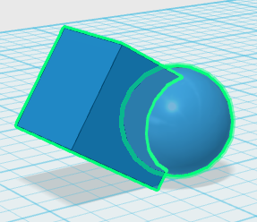 

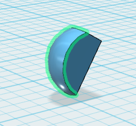

**Editing Faces, Edges and Vertices**

The press pull tool allows you to expand an object by dragging one face.

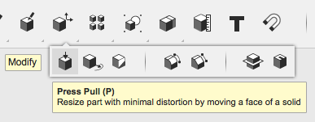

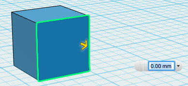

The tweak tool brings up the move and rotate tools to adjust one face edge, or vertex. The rest of the share will try to adjust with the face or edge you are adjusting. Only use tweak for small edits or you could crash the program.

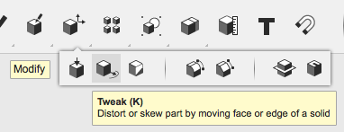 

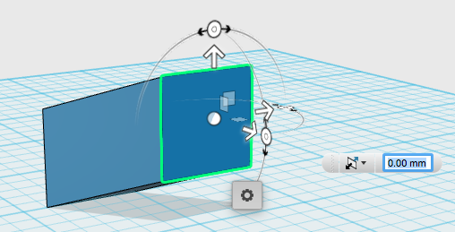

The fillet tool allows you to round down edges. You can round multiple edges at the same time by holding your ctrl button (or command on a Mac) while clicking on the edges you want to select. You can adjust the filleted edges using the arrow or the menu that will pop up below. 

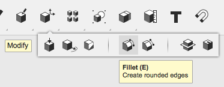

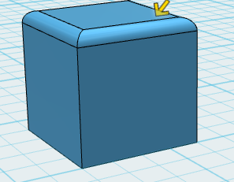

Chamfer works essentially the same as fillet, but instead of rounding the edge it cuts it at a 45 degree angle.

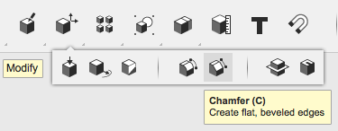

The shell tool will delete the face you select so that your object becomes hollow. You can also adjust the width of your remaining shell or select which part of the shell you want to adjust (inside or outside).

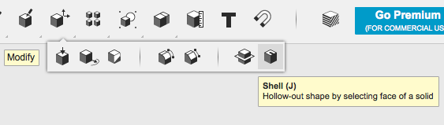

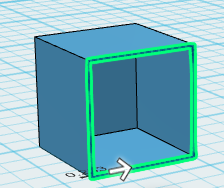

You can split a solid object using a line, sketch or another object.

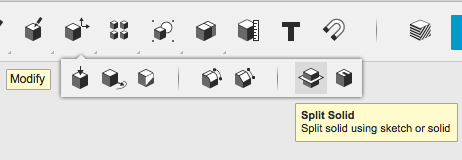

In this example, I used a sketch of a circle (placed underneath a solid cube) to cut out and then remove a circular section of the cube. You are able to select multiple objects to split.

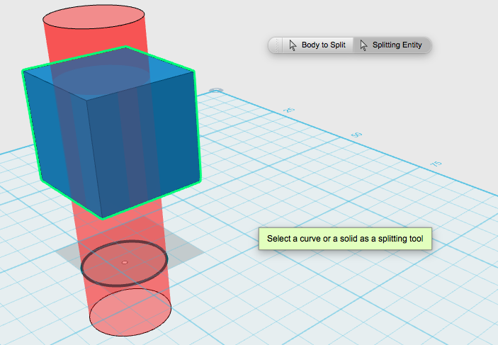

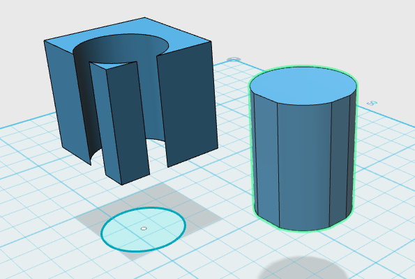

Split face works much like split object, except it only cuts through only one face of the object. You can then push/pull or tweak the multiple sections of that face. Below split a circle out of one face, then pulled the surrounding sections to be taller than the rest of the face.

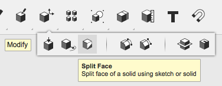

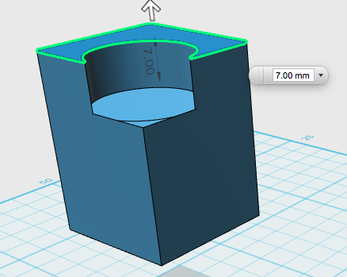

**Create a Pattern of Solids**

You can also create a pattern of solids through a variety of methods.

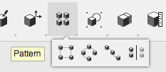

You need to indicate which solid you want to use for your pattern and what direction you want the pattern of shapes to appear. 

You can create a pattern based on a rectangle. In this example I used the sketch of a rectangle to indicate the direction of my pattern.

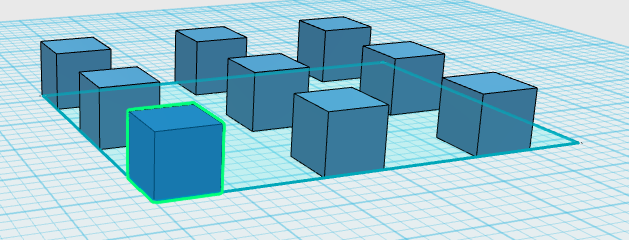

Or you can create a circular pattern. 

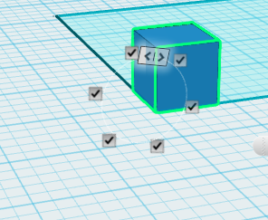

In this example I used an edge from the rectangular sketch as my axis and patterned several circles around it. 

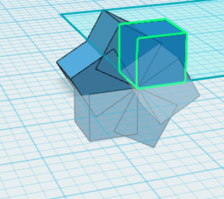

You can create a mirror pattern. Here I've indicated the side of the rectangle sketch to act as my mirror.

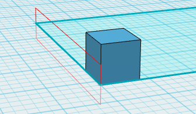

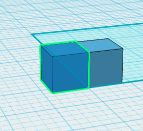

You can also pattern along a path. I used the rectangle sketch as my path. I used the yellow arrow to drag the pattern of cubes along the rectagular path.

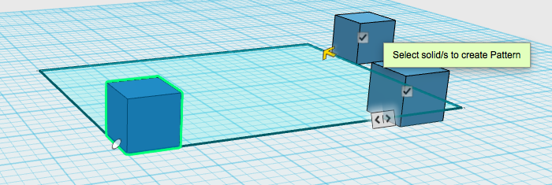

You can also adjust the number of solids you want in your pattern in the popup menu. 

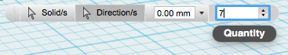

**Project onto a Solid**

You can also project a sketch onto the face of a solid using the project tool.

You will need to first select the face you want to project onto, at which point the grid will cover that face. Then you can indicate the face of another solid to project onto your surface. Make sure the face you choose to project is directed towards your chosen screen or it will not appear on the surface at all. 

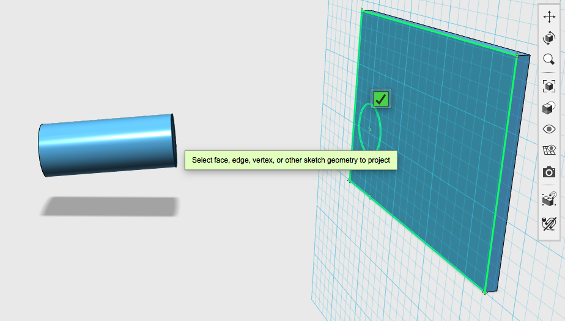

**Starting from a Sketch**

You can start with a primitive sketch from the primitives menu. You can set these on any flat surface (ex. On the grid or on the side of an object).

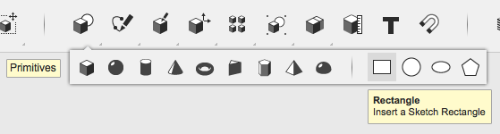

Or you can build your own sketch using a variety of sketch options. For each of these options you need to select where you want to sketch first (ex. On the grid or on a solid face). You can select a square, circle or elliptical sketch to place by hand. The fourth option is the polygon sketch, which allows you to specify how many sides you want your sketch to have, and allows you to sketch a variety of polygons, with sides of equal length. 

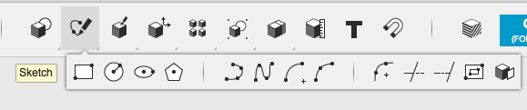

The Polyline option allows you to make any shape by clicking on the grid where you want to put down a corner. You can draw straight lines by clicking from point to point, or you can drag and click to add an arc to your line. You can adjust the line length or arc degree by adjusting the cm or degree in the pop-up menus. Hit the esc button or click the green check mark to exit sketch mode. It is only considered a finished sketch if it is enclosed and the enclosed area is coloured light blue. 

 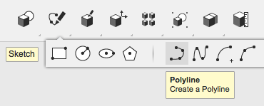
 
 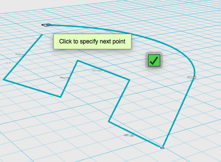

The spline option allows you to drop points just like polyline, but will automatically curve the line between each point. Spline doesn’t provide a pop-up menu for you to adjust degree or length of line by number.

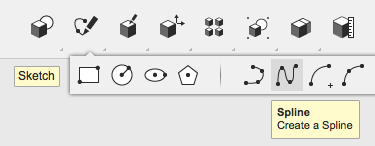

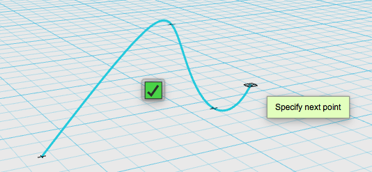

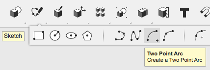

The two point arc allows you to put down two points on the grid: the centre of an imaginary circle, and the exterior of the circle (to indicate the circle’s radius distance). Once these points are selected it will allow you to draw a partial circle or arc using the radius you’ve selected as a guide.

Three point arc essentially allows you to put down two points, forming a line, then allows you to pull on a third point, somewhere along the line, to bend it into an arc. 

If you’ve put down part of a sketch and plan on using a different sketch tool to complete the sketch, be sure to preselect the preexisting part of the sketch so the program knows you are completing the sketch. Otherwise, it will just begin a new sketch and won’t connect the two parts you’ve created separately. 

**Offset a Sketch**

By choosing to offset a sketch you can creating larger or smaller versions of a sketching around or inside the original.

For this example I started with a simple elipsis sketch. 

Then I offset a larger version of the elipsis ourtside my original sketch.

**Extrude your sketch** 

Drag the arrow or adjust the size in the pop-up menu.

You can also adjust the shape of your extruded sketch using the rotation tool. 

**Sweep a Sketch**

You can design your own solid by creating a path, then inserting a profile (or closed stetch) to indicate the shape of the new solid.

In this example I used an arch for my path and a circle for my profile.

The finished shape combined the two sketches. 

**Revolve a Sketch**

You can also design your own solid by revolving a sketch around an axis. In this example, I revolve my own odd shaped sketch around a square.

The side of the square that is highlighted in yellow is acting as my axis. I can then use the rotary tool to wrap the other sketch around the highlighted axis, or I can indicate how many degrees I want the shape to wrap around the axis in the popup menu. 

**Loft Sketch or Solids**

Lofting several sketches or solids will connect them by forming a skin between chosen shapes. In this example, I've places the sketch of a circle above a rectangular sketch, then connected them using the loft option. 

**Combining Sketches and Solids**

When you extrude a sketch into or past an existing solid it will automatically try to subtract the part of the solid it is overlapping with. However, you can choose to merge or intersect the shapes. Or you can ask the program to make it into a new solid, in which case it will just hide the original shape inside the new shape, so the two shapes can be separated later. 

**Measuring your object**

If you select the measure button from your main menu this pop-up menu will appear. It allows you to measure the distance, angle, area, or volume of your model.

The ruler tool allows you to place a ruler on the grid, or on an object, in order to measure distance. 

Place your ruler, then click on the object you want to measure the distance to. 

This will provide you with details about the object (distance from ruler to grid, distance from rulers origin point to border of object, distance between objects, etc).  

A drop down menu will allow you to select the point in an object you want to measure from.

**Change the colour or visible texture of your model**

Select the material button from your main menu and a pop-up menu will appear, allowing you to adjust colour and visible texture.

