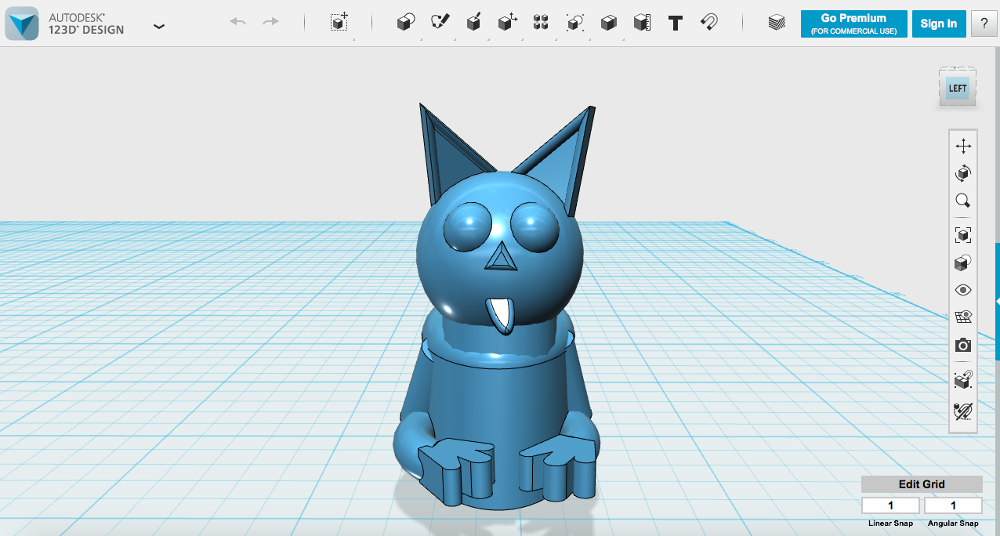
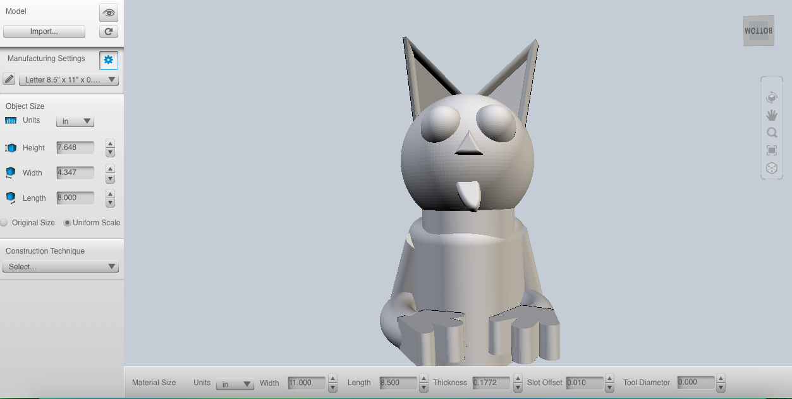
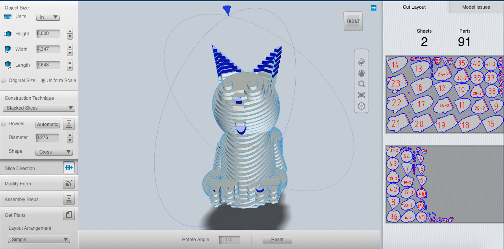
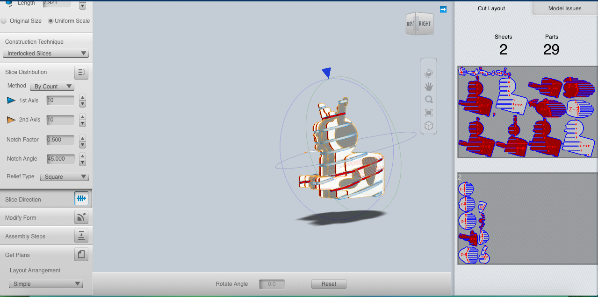
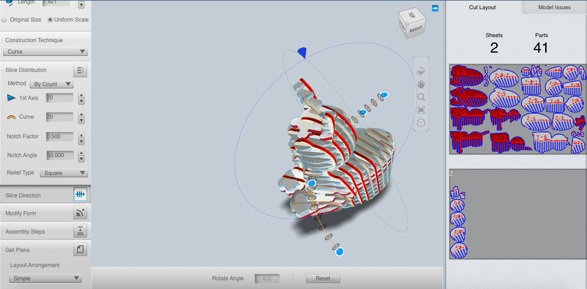
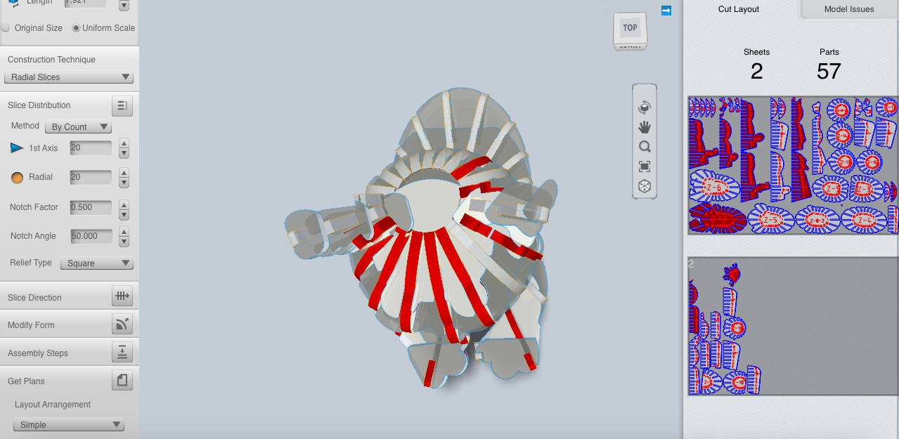
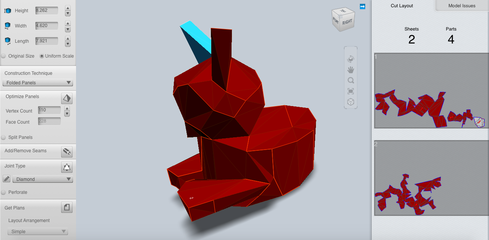

#Introduction to 123D Make

123D Make allows you to turn digital 3D models into 2D parts that you can print, then reassemble into a physical 3D model. I’ve modeled a simple version of Lil Bub the cat in 123D Design that I will be printing using 123D Make. 

When you open 123D Make, there are several menus on the left side of the program.

**Manufacturing Settings** - Allows you to indicate the size of the material you will be printing on. 

**Object size** -  Allows you to adjust the size of the object itself.  

Once you’ve indicated the size of your object and your printing material, you can choose what construction technique you’d like to use from the following options. 

##Stacked Slices

Once you select this option, the program will automatically slice your model into layers based on how thick your material is (as you’ve indicated in the manufacturing settings). Several additional menu options will also appear. 

**Dowels -** You will be able to indicate if you want dowels to hold together your model, and what shape and size those dowels should be.

**Slice Direction -**Adjust the slice direction by dragging a small blue triangle around the object. Slices that are not structurally sound will be highlighted in blue so you can adjust your slices to a better angle. 

**Modify Form -**This option will allow you to modify your form by making it hollow, making it thicker, or by shrinkwrapping it. This can help create a simpler version of your model, which makes it easier to print into into parts. 

**Assembly Steps** - Step by step assembly instructions. It can be hard to know the exact order of the parts once they have been printed, so this feature can be very helpful. 

**Get Plans -**This will allow you to print your project, or export the print plans as an EPS, PDF, or DXF.

##Interlocking Slices

The interlocking slices menu provides many of the same options as the stacked slices menu, It also includes a slice distribution menu. 

**Slice Distribution -** Allow you to adjust how many cross sections you want your interlocking pieces to have. It also allows you to adjust the notch factor, notch angle, and relief type. 

Slices that are highlighted in red indicate where there will be errors in the assembly of the model because certain sections may have been cut off from the model. You can still print these parts, but it will mean that details on your model may be lost. For example, in my model, it was nearly impossible for me to include Lil Bub’s tongue if I wanted to print an interlocking model. 

##Curve

Curve works essentially the same way as interlocking slices. The main difference is that the slices along the curves axis aren’t necessarily parallel to one another. This can allow for slightly more detail in your interlocking model.

##Radial Slices

Radial slices are also interlocking, but they fan out from a central point in the model. 

##Folded Panels

The folded panels option allows you to print your model onto paper, and then fold the paper pieces into roughly the same shape as your model. The folded panels menu also allows you to adjust the panels and seams for easier construction.

**Optimize panels** - adjust the number of vertex or face count on your model

**Add/or remove seams**

**Joint Type**- adjust the kind of joint used or add perforations.

##3D Slices

The 3D slice option allows you to see how your model might be 3D printed, but it doesn’t provide plans to print or export your 3D slices.

