# Day 1: Arduino

*By Tiffany Chan, based on notes by Nina Belojevic and Shaun MacPherson.*

## Overview

* [What is Arduino?](#intro)
* [Terminology](#terminology)
* Setup
  * [A. The IDE](#setup-a)
  * [B. Serial Port and Board Selection](#setup-b)
  * [C. Putting It All Together](#setup-c)
* [Exercise 1 - Blinking LED](#one)
* [Exercise 2 - Blink to Button](#two)
* [Exercise 3 - LED to Piezo](#three)
* [Exercise 4 - Digital to Analog](#four)
* [Exercise 5 - Light to Sound](#five)
* [Exercise 6 - Sound to Motion](#six)
* [Exercise 7 - Make Your Own!](#seven)

##  What is Arduino?

An Arduino is an open source, tiny computer made for tinkering, prototyping. It can also be used as a dedicated component in an interactive project (e.g. soldered to other parts or sewn into clothing)—hence the small size and lowish cost. Arduino combines open-source hardware, an integrated development environment (IDE) software, and a simplified version of the C/C++ programming languages that even non-programmers can use to write code for the Arduino board.

In this module, we will be using the Arduino for *physical computing*—that is, to sense and interact with the physical world. In practice, this involves converting one form of energy into another: for example, some kind of physical energy (e.g. light, sound, motion) into electrical signals and/or vice versa. When combined with other components or computers (e.g. the [Raspberry Pi](https://www.raspberrypi.org/help/what-is-a-raspberry-pi/)), the Arduino can do even more complicated things. Arduinos are commonly used for home monitoring projects (e.g. tripwire alarm, thermostat), wearables, and robotics. Throughout this module, I will briefly mention some example projects out in the wild that build on concepts we learn.

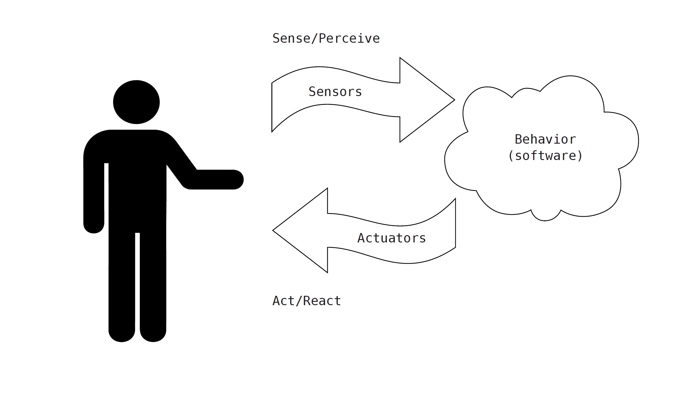
*"The Interactive Device," from* Getting Started with Arduino *by Massimo Banzi.*

## Some Terminology

* **Analog I/O**: Analog input and output expresses the voltage level across a variable resistance as numerical values. In other words, unlike digital I/O, which has only two states, analog values can have a range of states (on the Arduino, the input voltage can be expressed as a value between 0 and 1023)—analog I/O works like a dial or a slider.
* **Arduino**: An open-source hardware platform that consists of a board with a programmable microcontroller; various power, input, and output pins; some LEDs; and a USB connector. The Arduino works with an integrated development environment (IDE), the software used to program the board to behave in a certain way. Its hardware reference designs are distributed under a Creative Commons Attribution Share-Alike license, which means that anyone can make their own Arduino based on the original design.
* **Breadboard**: A type of prototyping board that enables you to design circuits without having to solder the components. Essential for designing things with Arduino.
* **Components**:  Parts of a circuit that change the behaviour of an electrical current. This includes sensors, such as buttons, potentiometers, and photoresistors, as well as resistors, capacitors, transistors, batteries, and jumper wires.
* **Digital I/O**: Digital I/O is expressed as a string of binary commands (1s and 0s, which each indicate an on/off state). In an * Arduino, whether the value is 1 or 0 is usually determined by the voltage: when the voltage is above a threshold, the Arduino reads this as “on,” and when the voltage is below the threshold, it is read as “off.” In other words, there are only two states. On and off—digital I/O basically works like a switch.
* **Input and Output (I/O)**: The communication between the computer/microcontroller system and the outside world through signals or data. Input is received by the system, and output is sent from the system.
* **Integrated Development Environment or IDE**: a special software program designed for you to write sketches that can be loaded onto your Arduino to effect certain behaviours. The programming language for Arduino is modelled after Processing (https://processing.org/download/) and based on the C/C++ languages. The software has a compiler built into it, which translates the sketch you write into a language understood by the Arduino microcontroller.
* **LED**: A light-emitting diode (LED) is a type of semiconductor: it only allows electricity to flow in one direction. When connected to a suitable voltage, LEDs release energy in the form of photons; this process is called electroluminescence, which is responsible for the production of different colours of light (depending on the energy of the photon released).
* **Microcontroller**: A small computer that is contained within an integrated circuit, or IC (otherwise known as a microchip). Microcontrollers are programmed to perform sets of simple operations, and are found in most devices (a thermostat, a car’s computer, etc.).
* **Open source**: A development model started within the software programming community that promotes universal access to source code and decentralized modes of peer-production to counter the model of proprietary, “black-boxed” code. More recently, the term “open source” (coined by nanotechnologist Christine Peterson) has been applied to hardware, where hardware developers freely share their designs with an intent to enable others to build or alter their original designs.
* **Photoresistor**: Variously called a photoresistor, a light-dependant resistor (LDR), or a photocell, this component variates its resistance according to how much light it is exposed to—typically, a photoresistor will range from 50 ohms to 1k ohms (i.e. less resistance) in direct exposure and from 5k ohms to several MegaOhms (i.e. more resistance) in the dark.
* **Potentiometer** or "pot": a potentiometer is a type of variable analog resistor that allows an operator to change the level of resistance by turning a dial, which is connected to a wiper that shortens or lengthens the part of a strip of conductive material that is exposed to the electrical current.
* **Piezo**: this term can refer to either a sensor or actuator of sound. We will mostly use it as an actuator, where it is commonly called a "piezo buzzer" or "piezo sounder." When an electric signal passes through a crystal in the piezo, it rapidly expands and contracts at a frequency that we interpret as sound.
* **Resistance**: Resistance, measured in ohms (Ω), hinders the flow of electric current. With the Arduino, resistance is important in the context of sensor expression—a sensor expresses its outputted data as a resistance value. For example, a photoresistor increases the resistance to the current it outputs to the Arduino when it is exposed to more light, and decreases the output when less light is exposed.
* **Sensors and Actuators**: These are electronic components that allow the microcontroller to communicate with its environment. Sensors sense various aspects of their environment (light, capacitance, temperature, etc.) and translate them into electricity that the Arduino can read so decisions can be made based on the code you wrote. Actuators then perform certain behaviours (e.g. an LED lighting up or a motor spinning) through the reverse process of transduction (converting code to electricity to light, movement, etc.).
* **Serial Monitor**: a built-in feature of the IDE that is useful for debugging or troubleshooting. For example, you can check values from various sensors in real time by printing them to the monitor.
* **Servomotor** or "servo": a servomotor is a type of rotary actuator that receives data that directs its speed and final position. This data is typically controlled by some kind of variable resistance, such as a potentiometer or photoresistor.
* **Sketch**: the block of code that you write, import, and/or upload to run on the Arduino board. This is what shows up in the white part of the IDE window.

##  Setup A – Install the IDE

* Download Arduino software (<http://www.arduino.cc/en/Main/Software>) 
* Mac: Once you’ve downloaded the IDE, you should see it in your downloads folder (or in the folder that your downloaded files get saved in). You should now be able to open the IDE by double clicking on the icon. Feel free to move it into a different folder (e.g. Applications). Once you’ve opened the software, plug in the USB connector we’ve provided.
* PC: When you download the Arduino IDE, you should be prompted to install Arduino. Follow the directions and install it in your Program Files or wherever you would like to save it to. Once the process is complete, open the Arduino program and plug in the USB connector we’ve provided.
* A Note on High DPI monitors: If your computer is fairly new, you might notice that the IDE's text is very tiny. If this happens, go to *File > Preferences*. Under *Interface Scale*, uncheck *Automatic* and increase the percentage next to it to make the text bigger. It may take a bit of experimentation to get the scale right (remember that you have to restart the IDE each time you adjust it). You can also adjust the font size of the code in the window by changing *Editor Font Size*.

## Setup B – Serial Port and Board Selection

* Connect the Arduino to your computer via the USB cable. A green light should turn on on the Arduino board.
* Mac Port Selection: Go to the Tools menu and hover over Serial Port. You’ll see a list of ports. One will begin with /dev/tty.usbmodem and one will begin with /dev/cu.usbmodem. Select one of these two.
* Mac Board Selection: Go to the Tools menu and hover over Board. Select the type of board you are using (in this case, Arduino Uno).
* PC Port Selection: Go to the Tools menu and hover over Port. There is typically only one choice, "COM3" or higher.
* PC Board Selection: Go to the Tools menu and hover over Board. It might already have preselected “Arduino Uno.” If not, select it from the menu.

##  Setup C - Putting It All Together

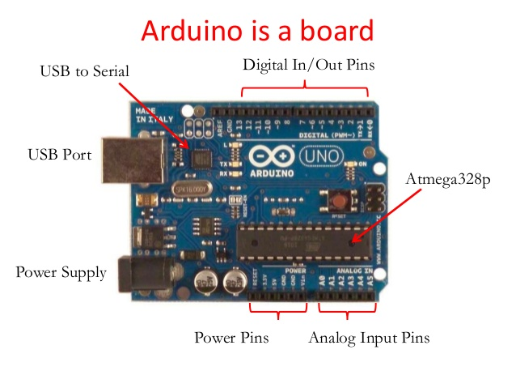

*Image care of Sravanthi Sinha via [SlideShare.net.](http://www.slideshare.net/SravanthiSinha/magnetic-door-lock-using-arduino-16578354)*

### The board:
* ATmega 28 - this is the actual microcontroller that has all the programmable functions you work with when you use an Arduino. All the other components on the board are for you and your computer to work with the Arduino.
* USB connector - this is where you hook up the USB cable to your computer.
* Power jack - you can hook up battery or adapter power through this.
* Digital IO pins 0-13 - you can hook up digital sensors and actuators to these pins.
* Analog In pins 0-5 - you can hook up analog sensors to these pins.
* Analog Out pins 2, 5, 6, 9, 10, 11 - you can program these digital pins to output for analog actuators. (If you look closely, the Analog Out pins have a ~ or # symbol beside the number.)

*Image of the breadboard, care of learn.sparkfun.com*

### The breadboard:
* Current runs vertically down the outer 2 columns (+/-) on each side and horizontally across the inside 10 columns (a-e and f-j)
  * e.g. if you connect a jumper wire to b4 and an LED to d4, they become part of the same circuit
* For some of the exercises, we will be connecting components to the breadboard and connecting the breadboard to the Arduino board to power them.

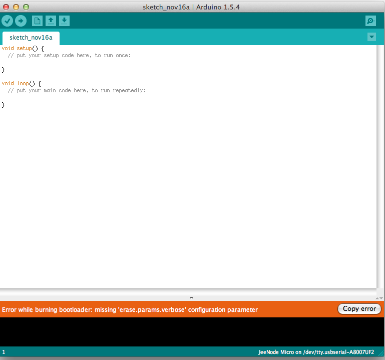

*Image of the Arduino IDE, care of jeelabs.net*

### The IDE:
* The white window: your current sketch. Copy/paste or type in code here.
* The black window along the bottom: this is for system messages. Any errors will show up here in orange.
* The checkmark: click to verify and compile the code.
* The right arrow: click to load your sketch onto the board.
* The Bare Minimum (<https://www.arduino.cc/en/Tutorial/BareMinimum>)
  * void setup{}: code in these brackets runs once, on upload.
  * void loop{}: code in these brackets runs repeatedly (until you unplug the Arduino or upload new code).
* Notes on troubleshooting:
  * If you get an error message after clicking the checkmark, there is an error with the code
  * If the sketch compiles fine but you get the error message after clicking the arrow, check to make sure you have the right port and board selected (under *Tools*)
  * If everything compiles and uploads fine, check your circuits and breadboard to make sure everything is connected properly

## Exercise 1 – Blinking LED

* Plug an LED into pin 13 and GND. The longer leg, the Anode (+), should go into pin 13. The shorter leg, the Cathode (-), goes into GND.

 

*Image 1: Blinking LED image from Getting Started with Arduino by Massimo Banzi (<http://phylab.fudan.edu.cn/lib/exe/fetch.php?media=yuandi:arduino:getting_started_with_arduino_v2.pdf>)*

* Once it’s hooked up, open the Arduino IDE. We will now insert the code to tell the Arduino what to do.
* Go to *File > Examples* and select *Blink* under *1. Basics*. This opens a new window with the sketch that tells the Arduino to blink the LED.
* In the sketch window, you can click on the checkmark icon to compile your code.
* Next, make sure you still have the correct Serial Port and Board selected.
* The arrow icon loads the code onto your Arduino board. Click on this now. You’ll see a confirmation message once the code has finished uploading.
* If everything works fine, you should now see the LED turn on for a second and then off for a second. If not, let’s troubleshoot together.

## Exercise 2 – Blink to Button

Now that we have the LED blinking, let’s add a button as a digital input sensor to control when it turns on or off.

* For this exercise, we are going to connect the power source to two of the columns on the breadboard. Connect the 5V pin to the (+) column and the GND pin to the (-) column. (Make sure the (+) and (-) column you connect are on the same side.) Now any sensor or actuator you connect to (+) on the breadboard will be connected to 5V and any sensor or actuator you connect to (-) on the breadboard will be connected to GND.
* For more on the breadboard, see here: http://www.instructables.com/id/Breadboard-How-To/
* Insert the button across the middle bridge on the breadboard. Hook up the bottom left leg of the button to 5V on the Arduino. Hook up the top right leg of the button to digital pin 2. Add the 10k Ohm resistor (brown-black-orange) with one leg along the same path as the bottom right leg of the button, and then connect the other leg of the resistor to GND.

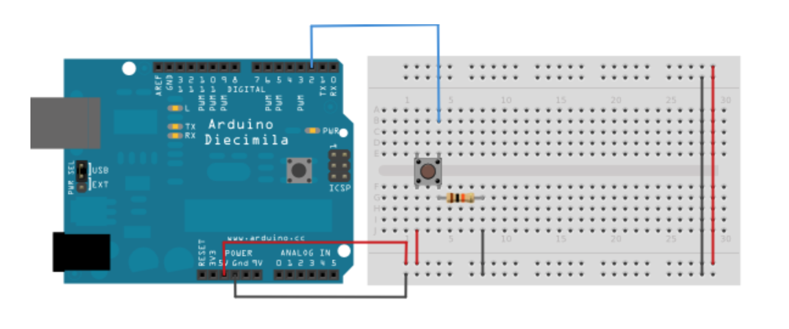
*Image 2: Fritzing Circuit from Arduino Tutorials (<http://www.arduino.cc/en/Tutorial/Button>)*

* Next, open your Arduino IDE and go to *File > Examples > 2. Digital > Button* and open that sketch.
* Once the code is uploaded and your circuit is built, connect the Arduino to your computer using the USB cable and make sure the correct board and port are selected (under Tools). In the IDE window, click on the checkmark icon to compile the code and make sure there are no errors. If error messages display in the bottom of your window, let’s troubleshoot.
* Once your code is free of errors, click on the arrow icon in the IDE window to load the code onto the Arduino. Now try to turn on the LED by pushing the button on the circuit. If it’s not working, review all your connections and we can troubleshoot together.

####Further Experiments
* Change the values inside `delay()`, upload, and see what happens
* Create different patterns of blinking on and off
* Fade the LED: <https://www.arduino.cc/en/Tutorial/Fade>
* Count the number of button presses: <https://www.arduino.cc/en/Tutorial/StateChangeDetection>

####Example Projects
* Spaceship Interface: <https://www.arduino.cc/en/ArduinoStarterKit/Prj02>
* Colour organ demo: <https://www.youtube.com/watch?v=x5hGF7NsG7Q>
* Easy LED Colour Organ: <https://www.youtube.com/watch?v=wJlglHS2w74>

## Exercise 3 - LED to Piezo

Now we're going to work with sound instead of light, using a piezo. A piezo is a small device that can both detect and play tones (that is, it can act as a sensor or an actuator). For this exercise, we're going to use it to play a short melody.

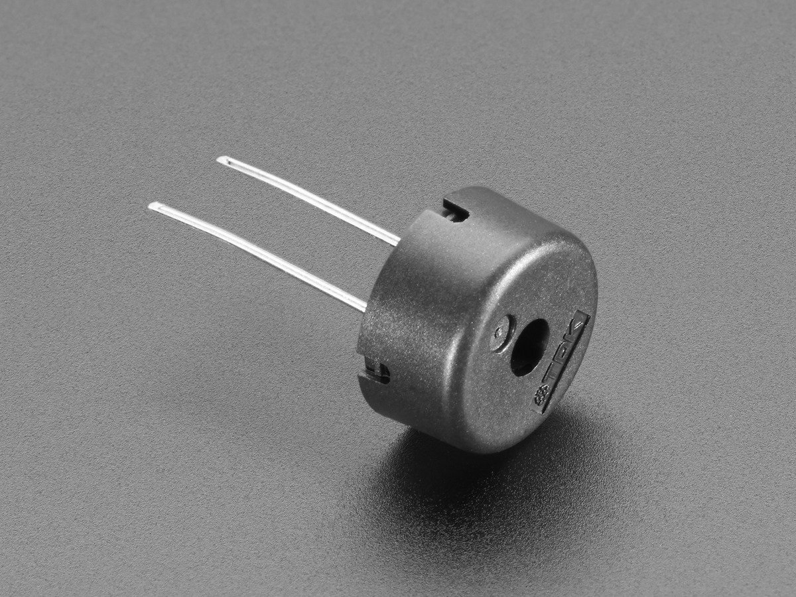

*Image of piezo buzzer/sounder care of Adafruit.*

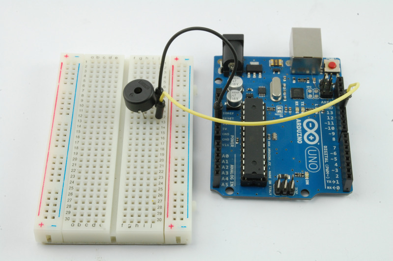

*Image care of Simon Monk (<https://learn.adafruit.com/adafruit-arduino-lesson-10-making-sounds/playing-a-scale>).*

* Insert the piezo to the breadboard. Connect one leg of the piezo to 5V and the other to pin 12. For these particular piezos, unlike the LED, it does not matter which leg connects to pin 12 and which connects to GND.
* Download, copy/paste, or type [the sketch](sketches/simpleSounds.ino) into your IDE
* Compile and upload your code. If you get an error, let's troubleshoot.
* I am piezo, hear me roar!

####More Things to Try
* Experiment with different notes and/or melodies by changing the values in the `tones[]` array. (If you change the number of tones, remember to change numTones to match!)
  * Use [this list](http://www.phy.mtu.edu/~suits/notefreqs.html) to find the frequency for each note (C4 = middle C).
  * You can also modify the length of each note by adding a comma and an extra value after `tones[i]` (see the [Reference page](https://www.arduino.cc/en/Reference/Tone) for `tone()`). For example, to play each note for half a second, the whole line would read as `tone(speakerPin, tones[i], 500);`, where 500 is the length in milliseconds.
  * As with Exercise 2, you can also change the value in `delay()` to shorten or lengthen the delay (in milliseconds) between each note.
* Try incorporating a button into your circuit and sketch so that the sound only plays if you press the button. Hint: you might want to take a look at the code for the Button exercise again (*File > Examples > 2. Digital > Button*).

####Example Projects
* Knock: <https://www.youtube.com/watch?v=1SNC3ib10_4>. This project uses a piezo as a sensor instead of an actuator.
  * Project page: <https://www.arduino.cc/en/Tutorial/Knock>
* Morse Code: <http://www.instructables.com/id/Arduino-Morse-Code/>
* Beetbox: <https://vimeo.com/55658574>. This project uses capacitative touch sensors, one connected to each beet.
  * Note: we do have touch sensors if you want to use them for your own prototype later.

## Exercise 4 - From Digital to Analog

Next, let’s incorporate analog input. Instead of allowing for only two states (On/Off or High/Low), analog input translates voltage (from 0 to 5 volts) into numbers between 0 and 1023. For this exercise, we're going to use a potentiometer, or "pot," to modify the piezo's pitch.

*Image of potentiometer, care of notey.com.*

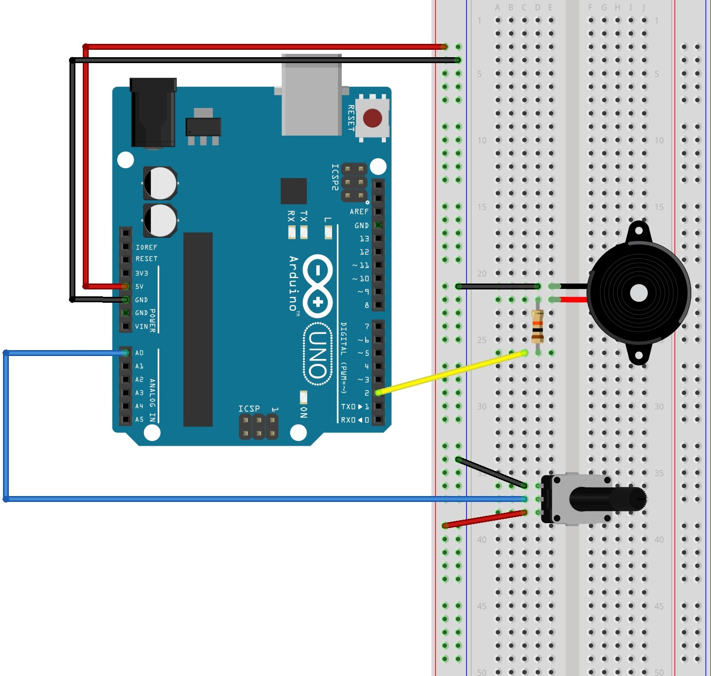

* Insert the potentiometer into the breadboard. The pot has three legs: connect the middle leg to analog pin A0, one of the outer legs (doesn't matter which) to (+) or 5V and the other to (-) or GND.
* If you took the piezo off the breadboard, reattach it. Connect one leg through a 10k ohm resistor (brown-black-orange) to digital Pin 2 and the other to GND.
* [Click here](sketches/tonePitchFollower.ino) and copy paste the code into a new file.
* Verify and then upload the code to the Arduino.
* Twist the potentiometer to change the pitch. To stop playing, unplug the Arduino.
* Click the magnifying glass at the top right hand corner of the IDE. The window that just popped up is called the Serial Monitor, which communicates information between the board and your laptop—often for the purposes of debugging (analogous to a console for other programming languages). If everything is working, you should see a stream of neverending numbers that correspond to the signal/value of analog pin A0 coming from your pot (this is the value that Arduino is using to calculate the pitch). Twist the pot to watch the number change. The Serial Monitor can be useful for debugging; for instance, if you don't see numbers showing up in the Monitor, then you know the Arduino is not sensing input properly from the pot. To learn more about printing information to the Serial Monitor, see the [AnalogReadSerial exercise](https://www.arduino.cc/en/Tutorial/AnalogReadSerial).

####More Things to Try
* Throwback to earlier today when we were blinking LEDs. Try [this exercise](https://github.com/uvicmakerlab/dhsi2015/blob/master/DHSI2015ArduinoNotes.md#exercise-3--using-a-potentiometer-for-analog-input) from last year's DHSI to use the potentiometer to adjust the blinking speed of an LED.

## Exercise 5 - From Light to Sound

You can measure many different kinds of analog input (e.g. temperature, light, moisture) using different sensors for the Arduino. We will now use a different sensor to modify the piezo's pitch. For this exercise, we're going to replace the potentiometer with a photocell or photoresistor to create a pseudo-theremin, based on the original [theremin instrument](https://www.youtube.com/watch?v=pSzTPGlNa5U). Where the theremin's pitch varied with the player's hand position, the pseudo-theremin's pitch varies with the amount of light that the photocell receives.

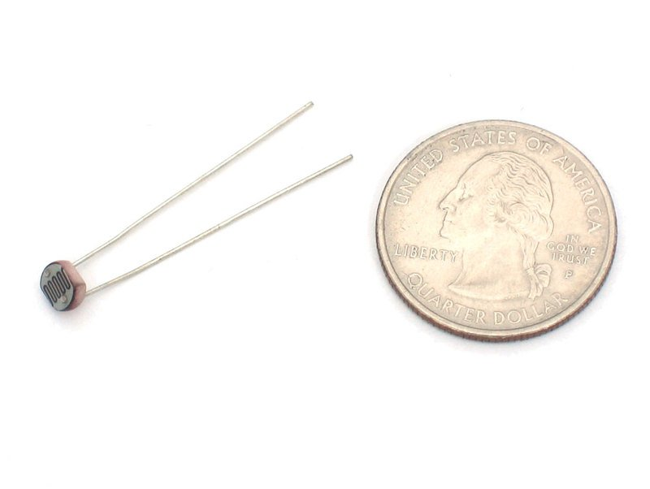

*Image of a photocell care of Adafruit. (<https://learn.adafruit.com/photocells/using-a-photocell>)*

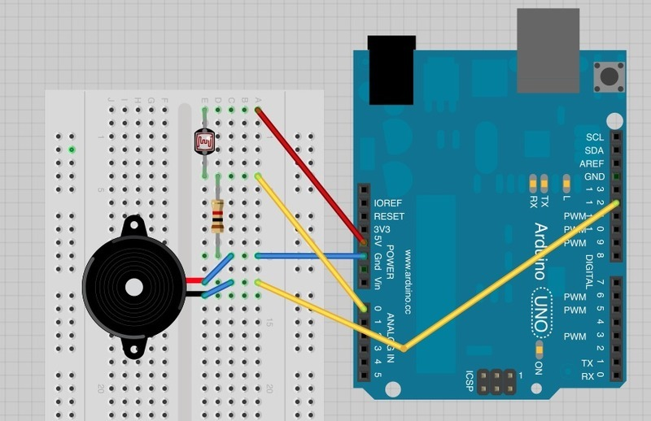

*Diagram care of Simon Monk. (<https://learn.adafruit.com/adafruit-arduino-lesson-10-making-sounds/pseudo-theramin>)*

* The piezo should still be connected to the Arduino from the last exercise. If not, reattach it to the breadboard and Arduino board. Connect one leg to digital Pin 2 and the other to GND.
* Insert the photocell into the breadboard. Connect one leg to 5V. On a different row on the breadboard, connect the other leg of the photocell, a 1k ohm resistor (brown-black-red) and analog pin A0.
* Connect the other leg of the 1k ohm resistor to GND.
* Open [this sketch](sketches/pseudoTheremin.ino) and copy/paste the code into your IDE.
* Compile and upload it.
* Wave your hand or another object over the photocell to vary the pitch. Try moving your hand closer or farther away from the photocell.

####More Things to Try
* Throwback to earlier today when we were blinking LEDs. This extra exercise will adjust the blinking speed of an LED with the help of a photocell. Connect an LED to pin 13 and GND as in the Blink exercise. Swap out your 1k ohm resistor for a 10k ohm resistor (brown-black-orange—yes, they are confusingly similar). Open the analogInput sketch by going to *File > Examples > 3. Analog > AnalogInput*. Upload and compile it. Have fun!

####Example Projects
* Laser Trip Wire by Ronnie Tucker: <https://www.youtube.com/watch?v=efA9lwmE5zA>
* Little Slide Dress by Emily Steel: <https://www.behance.net/gallery/Little-Slide-Dress/3932109>
* Sunscreen Reminder Hat by Becky Stern: <https://learn.adafruit.com/sunscreen-reminder-hat/overview>

## Exercise 6 - From Pot to Servo

For this sketch, we will use a different actuator—a servo motor—and control its position using a potentiometer. The sketch we wil use will translate the position of the potentiometer into a coordinate that will instruct the servo to rotate its drive shaft to that fixed position.

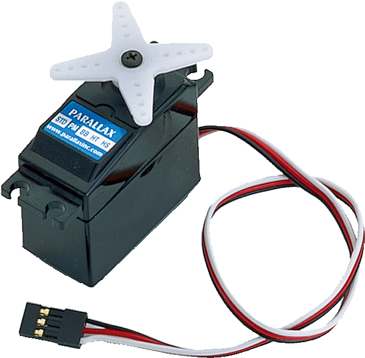

*Image of servo motor (above) care of inexglobal.com*
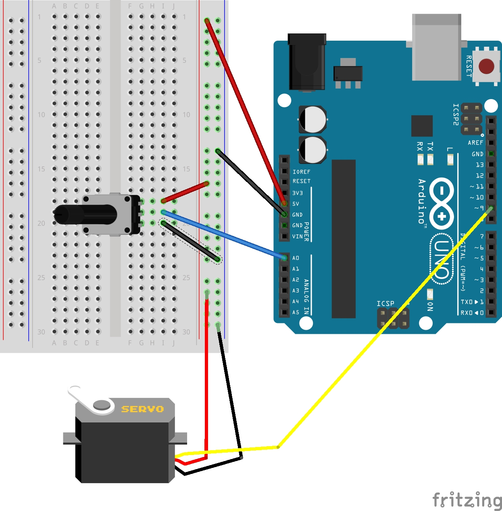

* Insert the potentiometer into the breadboard and connecting it as we did for the Exercise 4. Connect the middle leg to analog pin A0, one outside leg to 5V or (+) on the breadboard, and the remaining leg to GND or (-) on the breadboard.
* Next, we will connect the servo motor. (Note that the wires on your servo motor will be either in the configuration black-red-white or brown-red-orange—these are analogous to each other.) Connect the red wire to a pin on the (+) strip of the breadboard, the black/brown wire to (-), and the white/orange wire to digital pin 9 on the Arduino.
* Copy/paste the code from [this page](https://www.arduino.cc/en/Tutorial/Knob) into the IDE.
* Compile and upload the sketch.
* The servo should automatically rotate to the position indicated by the position of the potentiometer. Try rotating the dial on the potentiometer—the servo should move accordingly. It may or may not shake or vibrate—this just means that it’s receiving too much voltage through the upper limit of the potentiometer. Just rotate the potentiometer until the servo runs smoothly.

####Example Projects
* Waves of Leaves by Soyoung Park: <http://www.shine-sy.com/wavesofleaves/>
* Stroboscope/Zoetrope by MrScripster: <https://www.youtube.com/watch?v=fSy2JYkdn-c>
* Chopping Machine by Simone Giertz: <https://youtu.be/ISPnkVMxkcs?t=1m29s>

## Exercise 7 - Make Your Own!

For the rest of the session, you can experiment with different combinations of sensors, actuators, and code. We also have foil for touch sensors, flex sensors, LCD displays, and temperature sensors. Here are some tutorials to get started:

####Temperature
* Using a Temp Sensor: <https://learn.adafruit.com/tmp36-temperature-sensor/using-a-temp-sensor>
* Love-o-meter: <http://runningwithcodes.blogspot.ca/2014/02/building-love-o-meter-by-using.html>

####LCD Displays
* Print "Hello World!" to the display: <https://www.arduino.cc/en/Tutorial/HelloWorld>
* More about the display from Adafruit: <https://learn.adafruit.com/adafruit-arduino-lesson-11-lcd-displays-1/overview>
* Using a temperature sensor, photocell, and potentiometer, measure light level and temperature and print them to the LCD display: <https://learn.adafruit.com/adafruit-arduino-lesson-12-lcd-displays-part-2/overview>

####Touch Sensors
* Capacitive Touch Sensor, using the CapSense library and aluminum foil:
  * General information: <http://playground.arduino.cc/Main/CapacitiveSensor?from=Main.CapSense>
  * Tutorial: <http://www.instructables.com/id/How-To-Use-Touch-Sensors-With-Arduino/step4/Touch-Controlled-Light-Materials-Required/>
  * Video demo: <https://www.youtube.com/watch?v=BHQPqQ_5ulc>
* With a pencil drawing:
  * <http://www.instructables.com/id/Turn-a-pencil-drawing-into-a-capacitive-sensor-for/>
 
####Other
* Arduino Pushbutton Musical Keyboard: <http://www.hjort.co/2016/02/arduino-musical-keyboard.html>
* RGB LEDs: <https://learn.adafruit.com/adafruit-arduino-lesson-3-rgb-leds/overview>
* PIR Motion Sensor: <http://www.dummies.com/how-to/content/how-to-detect-movement-with-the-arduino.html>
  * see also: <http://bildr.org/2011/06/pir_arduino/>
* Infrared sensor: (scroll down to QRD1114) <http://bildr.org/2011/03/various-proximity-sensors-arduino/>
* Flex Sensor: <https://learn.sparkfun.com/tutorials/sik-experiment-guide-for-arduino---v32/experiment-9-using-a-flex-sensor>

####What other things can Arduinos do? SO MANY things!
* Botanicalls by Rob Faludi, Kate Hartman and Kati London: Measure moisture in your plant's soil and tweet at you when your plant is thirsty. (<https://www.botanicalls.com/>)
* The Cover That Judges You by Thijs Biersteker: Scan your face for emotions and unlock a book only when you're straight-faced. (<http://thecoverthatjudgesyou.com/>)
* Spam Poetry by Varvara Guljajeva and Mar Canet Sola: Knit a spam poetry sweater for you. (<http://www.mcanet.info/blog/?p=404>) 
* Netflix socks: Automatically pause Netflix when you've fallen asleep watching it. (<http://makeit.netflix.com/>)
* Electronic Popables by Jie Qi, with Leah Beuchley and Tshen Chew. (<http://technolojie.com/454/>)

####Where can I find more Arduino projects and/or tutorials?
* Arduino: <https://www.arduino.cc/en/Tutorial/HomePage>
* Adafruit: <https://learn.adafruit.com/category/learn-arduino>
* Sparkfun: <https://learn.sparkfun.com/tutorials/tags/arduino>
* *Getting Started with Arduino* by Massimo Banzi: <http://eclass.sch.gr/modules/document/file.php/EL19138/Massimo%20Banzi-Getting%20Started%20with%20Arduino%20-Make%20(2011).pdf>
